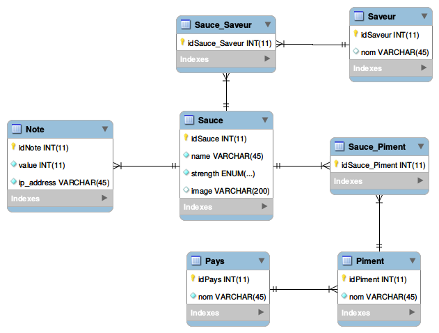

# Deploiement
## Base de données
- Installer MySQL si nécessaire : `sudo apt-get install mysql-server`
- Créer un utilisateur pour Spicy world si nécessaire :
  * `mysql -u root -p`
  * `CREATE USER 'spicyworld'@'localhost' IDENTIFIED BY 'dune';`
  * `GRANT ALL PRIVILEGES ON * . * TO 'spicyworld'@'localhost';`
- Importer le schéma décrit dans `schema.sql` :
  * `mysql -u spicyworld -p < schema.sql`	

## Lancement
- Se déplacer dans le dossier [sources](sources)
- `./bin/activator`
- `~run`
- `Naviguer vers [localhost:9000](http://localhost:9000/)

# Discussion
*Mélanie Huck et James Nolan, juin 2016*

## Introduction
SCALA est un cours à option de la HEIG-VD, offert aux étudiants en Informatique de troisième année. La première partie du cours enseigne les bases de Scala, un langage de programmation fonctionelle. La fin du cours est dédiée à la réalisation d'un projet mettant en pratiques les notions vues lors de la première partie.

Le projet se déroule sur 5 séances et doit être réalisé par groupes de deux étudiants. Le choix du projet à réaliser est libre, tant qu'il correspond à l'une des trois architectures proposées :
- Application web/mobile (back-end en [Play Framework](https://www.playframework.com/) + frontend en [Scala.js](https://www.scala-js.org/) + application mobile Android)
- Application mobile (backend en Play Framework, application mobile en [Scaloid](https://github.com/pocorall/scaloid))
- Application web (backend en Play Framework, base de données avec [Slick](http://slick.lightbend.com/))

Il est à noter que la première architecture demande beaucoup de travail, car elle nécessite de programmer dans trois environements (serveur, navigateur et Android). De plus, une base de données devrait probablement être intégrée de toute façon car un backend sans persistance n'est pas très intéressant.


## Choix du projet
Comme nous avons une meilleure connaissance du développement web qu'Android, nous avons choisi de développer notre projet autour de la troisième architecture.

Pour illustrer l'intérêt de Slick, nous avons trouvé que la base de données devait être un élément central de notre projet. Le framework Play serait utilisé pour permettre à ses utilisateurs d'intéragir avec la base de données au travers d'une interface web.

En pratique, nous avons décidé de concevoir une plateforme pour les amateurs de sauces piquantes.

## Technologies
Avant de décrire notre projet en détail, il est utile de rappeler les technologies qu'il nous est demandé d'utiliser.

### Play Framework
Play est un framework permettant de concevoir des applications web. Il est compatible avec Java et Scala. Bien entendu, notre projet sera programmé en Scala.

Play adopte le pattern [modèle-vue-contrôleur](https://fr.wikipedia.org/wiki/Mod%C3%A8le-vue-contr%C3%B4leur) (MVC). Dans une architecture de type MVC, les composants sont séparés en trois groupes de responsabilités. Le *modèle* décrit les données manipulées par l'application. Il est chargé de communiquer avec la base de données et traiter les données qui y sont insérées ou récupérées. La vue est chargée d'intéragir avec l'utilisateur. Elle met en forme les données du modèle et réagit aux actions de l'utilisateur. Elle communique ces événements au contrôleur. Le *contrôleur* est responsable de définir les actions à effectuer lorsque la vue lui communique les actions de l'utilisateur.

Dans le Framework Play, Les contrôleurs et modèles sont codés en Scala.

Pour générer les vues, Play intègre [Twirl](https://www.playframework.com/documentation/2.5.x/ScalaTemplates), un *template engine* capable de générer du code HTML dynamiquement. Un template Twirl est un fichier HTML dans lequel il est possible d'insérer du code Scala, afin d'y intégrer dynamiquement les données issues du modèle. Par exemple, le template suivant génère une liste de sauces, en supposant qu'une classe `Sauce` est définie et contient un attribut `name` :

```scala
@(sauces: List[Sauce])
<ul>
@for(sauce <- sauces) {
	<li>@sauce.name</li>
}
</ul>
```

### Slick
Slick est une librairie permettant de communiquer avec une base de données relationnelle depuis Play. Les requêtes sont écrites en Scala, offrant ainsi un code concis et un typage consistant. Slick peut "traduire" ces requêtes pour MySQL, PostgreSQL ainsi que d'autres systèmes de gestion de bases de données.

Par exemple, une table `Countries` contenant des pays, décrite par une simple colonne `name` est représentée en Scala de la manière suivante :

```scala
class Countries(tag: Tag) extends Table[(String, Double)](tag, "Countries") {
	def name = column[String]("name", O.PrimaryKey)
	def * = (name)
}
val countries = TableQuery[Countries]
```

Une requête sur cette table, comme lister les pays se terminant par "land", peut être écrite de la manière suivante :

```scala
val query = for {
  country <- Countries if country.name like "%land"
} yield (country.name)
```

Cette requête est traduite par Slick en langage SQL :
```sql
SELECT name
FROM Countries
WHERE name LIKE '%land'
```

## Cas d'utilisation
Notre plateforme doit permettre à l'utilisateur de voir la liste des sauces piquantes, voir les détails d'une sauce piquante (dont une photo) et de pouvoir en ajouter de nouvelles.

Une sauce piquante est composée de différentes saveurs. Les utilisateurs doivent pouvoir décrire les sauces piquantes par une ou plusieurs saveurs, et en ajouter lorsque la saveur n'existe pas encore.

Une sauce piquante est typiquement composée de différents piments. L'utilisateur doit pouvoir consulter la liste des piments, et de pouvoir en ajouter de nouveaux.

Pour faire simple, un piment est *originaire d'un pays*. La liste des pays doit être consultable, ainsi que le nombre de piments qui y ont leur origine.

Les visiteurs pourront noter les sauces piquantes.

## Base de données et modèles
A partir des scénarios décrits ci-dessus, nous avons isolé X entités que notre base de données devait modéliser :

Une `Sauce` possède un `nom`, une force (`strength`) et une `image`.

Une `Note` possède une valeur (`value`) et une adresse IP (`ip_address`).

Une `Saveur`, un `Piment` et un `Pays` possèdent un `nom`.

Par ailleurs, une `Note` est liée à une `Sauce` (*many-to-one*), un `Piment` est lié à un `Pays` (*many-to-one*).

Finalement, une `Sauce` est liée à une ou plusieurs saveurs (*many-to-many*), ainsi qu'à un ou plusieurs `Piment`s (*many-to-many*). Ces deux relations nécessitent l'introduction d'une classe d'association.

A partir de ces observations, nous avons conçu notre base de données comme suit :



Le code SQL générant cette structure est disponible dans le fichier [schema.sql](schema.sql). Pour nous faciliter la tâche, nous nous sommes aidés du logiciel [MySQL Workbench](https://www.mysql.com/products/workbench/).

Une fois la base de données crée, il a fallu coder les modèles correspondants. Ces modèles sont disponibles dans le dossier [app/models/](sources/spicy-world/app/models), nous n'allons pas tous les détailler dans ce rapport.

Nous allons toutefois mentionner un cas de figure que nous avons trouvé intéressant : la façon dont sont gérées les requêtes nécessitant des tables de jonction. Par exemple: comment lister toutes les sauces, et pour chaque sauce, sa liste de piments ?

Pour ce faire, il est nécessaire de modéliser la table de jonction comme les autres :

```scala
class SaucesToChilies(tag: Tag) extends Table[SauceToChili](tag, "Sauce_Piment") {
  def sauceId = column[Int]("idSauce")
  def chiliId = column[Int]("idPiment")
  def * = (sauceId, chiliId) <> ((SauceToChili.apply _).tupled, SauceToChili.unapply)
}
```

Ensuite, slick permet d'effectuer une requête en utilisant cette table :
```scala
lazy val sauces = TableQuery[Sauces]
lazy val saucesToChilies = TableQuery[SaucesToChilies] 
lazy val chilies = TableQuery[Chilies]
val query = sauces
			joinLeft saucesToChilies on (_.id === _.chiliId)
			joinLeft chilies on (_._1.id === _.id)
```

## Routes et contrôleurs
Le protocole HTTP définit plusieurs types de requêtes. Par exemple, le protocole définit la commande `GET` pour récupérer un fichier, et la méthode `POST` pour envoyer des données à sauvegarder. Il existe d'autres types de méthodes, mais `GET` et `POST` sont les plus utilisées car ce sont les seules qui peuvent être utilisées par des mécanismes intégrés à HTML : les liens `<a href="/sauces">...</a>` et les formulaires `<form action="/create_sauce">...</form>`, respectivement. Comme nous nous servons uniquement de `HTML` pour générer notre frontend, nous n'utiliserons que ces deux méthodes pour créer les routes.

Une *route* est une configuration indiquant à Play quelle méthode de quel contrôleur il faut utiliser pour générer chaque page. Par exemple, pour indiquer que la fonction `singleSauce` du contrôleur `SauceController` est en charge de traiter les requêtes du type `/sauce/1222`, où `1222` est l'identifiant de la sauce, il faut spécifier une route comme suit :

`GET	/sauce/:id 	controllers.SauceController.singleSauce(id: Int)`

Toutes nos routes sont disponibles dans le fichier [routes](sources/spicy-world/conf/routes).

Les contrôleurs contiennent les fonctions qui génèrent les vues en fonction de la page que le visiteur veut voir. S'il a envoyé des informations, via une requête `POST` par exemple, le contrôleur est d'abord chargé de mettre le modèle à jour.

Les contrôleurs ne font rien de très intéressant dans notre projet. Ils contiennent uniquement les fonctions qui mettent à jour le modèle (si nécessaire) et génèrent les vues. Il sont disponible dans le dossier [controllers](sources/spicy-world/app/controllers).

## Vues
Pour factoriser nos vues, nous les faisons "hériter" d'une vue de base, appelée [main.scala.html](/sources/spicy-world/app/views/main.scala.html). Cette vue contient le squelette d'une page. Elle contient la balise `<head>...</head>` et l'en-tête du site. La seule chose qu'elle ne contient pas est le *contenu* de la page. Les vues héritant de cette vue n'ont qu'à y faire appel. Elles ne doivent ainsi que générer le contenu de la page, sans devoir répéter les parties qui restent identiques entre les pages.

Nous avons aussi une vue particulière que nous avons appelée [message.scala.html](/sources/spicy-world/app/views/message.scala.html). Cette vue prend deux paramètres : un message à communiquer au visiteur, ainsi qu'une chaîne de caractère indiquant le *type* du message (`error`, `confirmation`,...). De cette manière, si le contrôleur doit communiquer une information comme le succès d'une méthode ou des erreurs dans un formulaire, il peut utiliser cette vue pour la communiquer. Le type du message est introduit dans le nom d'une classe, permettant ainsi de le styliser à l'aide de CSS. Les messages d'erreurs sont stylisés en rouge, les autres en vert.

Toutes les autres vues correspondent à des pages de notre site. Par exemple, il existe une vue pour lister les sauces et une autre pour générer le formulaire d'ajout d'une sauce.

Pour faciliter la création des vues, nous nous sommes aidés de la librairie [Bootstrap](https://getbootstrap.com/) pour profiter d'un grand nombre de classes prédéfinies.

## Conclusion
Ce projet nous a permis de nous familiariser avec l'utilisation de Scala dans un environement web. Plus précisément, nous avons appris les concepts de base permettant de faire tourner une application Scala avec le framework Play. Nous avons également appris à intégrer Slick dans un projet Play.

L'intérêt d'utiliser un outil comme Slick comme abstraction de la base de données est compréhensible. Cependant, nous ne sommes pas sûrs d'avoir saisi ses avantages à leur juste valeur. Ceci peut s'expliquer par le fait qu'il s'agissait d'un petit projet, qui aurait certainement pu se passer d'une telle abstraction, d'autant plus que nous avons une plus grande expérience avec le langage SQL. Nous ne doutons pas que Slick soit bénéfique dans de plus gros projets	, nécessitant d'être maintenus sur le long terme par plusieurs développeurs.